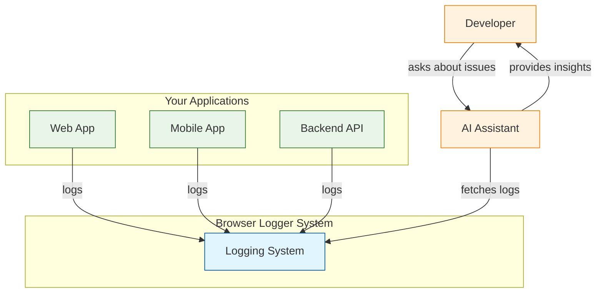

# `MCP-logger` - Logging System + MCP Server + Browser Integration

A lightweight logging system that captures frontend console logs and makes them accessible via MCP (Model Context Protocol). Perfect for development and debugging environments with AI assistants.

## 📋 System Overview

The Browser Logging System consists of three main components:

1. **Frontend Logger** (`mcp-logger.js`) - Captures console logs and sends to backend
2. **Backend Server** (`logger-server.js`) - Receives and stores logs from frontend
3. **MCP Server** (`mcp-server.js`) - Provides MCP access to stored logs

### 🏗️ Architecture Overview

#### System Context (C4 Level 1)


```mermaid
graph TB
    subgraph "Your Applications"
        app1["Web App"]
        app2["Mobile App"]
        app3["Backend API"]
    end

    subgraph "Browser Logger System"
        logger["Logging System"]
    end

    dev["Developer"]
    ai["AI Assistant"]

    %% Your apps send logs to the system
    app1 -->|"logs"| logger
    app2 -->|"logs"| logger
    app3 -->|"logs"| logger

    %% You interact with AI to get insights
    dev -->|"asks about issues"| ai
    ai -->|"fetches logs"| logger
    ai -->|"provides insights"| dev

    classDef yourApp fill:#e8f5e8,stroke:#2e7d32
    classDef logger fill:#e1f5fe,stroke:#01579b
    classDef person fill:#fff3e0,stroke:#f57c00

    class app1,app2,app3 yourApp
    class logger logger
    class dev,ai person
```

**How it works:**
1. Your applications send logs to the centralized logging system
2. You ask your AI assistant about issues or problems
3. AI retrieves and analyzes logs from any of your applications
4. You get actionable insights back from your AI assistant

## 🚀 Quick Start (5-Minute Setup)

### Step 1: Install Dependencies
```bash
cd mcp-logger
npm install
```

### Step 2: Configure (Optional)
```bash
# Copy the example configuration file
cp .env.example .env

# Edit .env to customize settings (optional):
# PORT=3000
# HOST=0.0.0.0
# MAX_LOG_ENTRIES=500
```

### Step 3: Start Backend Server
```bash
# Terminal 1
node logger-server.js
# Expected: 🚀 Browser Logger Server running on http://localhost:22345
```

### Step 4: Configure MCP Client
The MCP server uses STDIO transport and is launched automatically by your AI client:

```bash
# Quick setup with Claude Code CLI
node mcp-server.js mcp-help
```

With default app `my-app` (AI client will use MCP `FE-logs` only for app `my-app`):
```bash
claude mcp add FE-logs node $(pwd)/mcp-server.js \
    --scope local --env FILTER_APP=my-app
```

Or use base setup (requires app parameter in get_logs calls):
```bash
claude mcp add FE-logs node $(pwd)/mcp-server.js
```

**Test with MCP inspector:**
```bash
npx @modelcontextprotocol/inspector --cli node $(pwd)/mcp-server.js \
  -e FILTER_APP=my-app --method tools/call --tool-name 'get_logs'
```

### Step 5: Add to Frontend Application

Add this single script to your HTML file - it handles both online and offline scenarios automatically:

```html
<script>
window.MCP_LOGGING_ENABLED = true;
window.MCP_LOGGING_APP_NAME = 'my-app';  // REQUIRED: Set your app name
window.MCP_LOGGING_BACKEND_URL = 'http://localhost:22345';
(function() {
    // Try to load from server first, fallback to local file
    var script = document.createElement('script');
    script.src = 'http://localhost:22345/mcp-logger.js';
    script.onerror = function() {
        // Server is down, create a simple fallback logger
        console.log('MCP Logger server offline, using local fallback');
        window.logger = {
            log: function(namespace, data) {
                console.debug('[' + namespace + ']', data);
            }
        };
    };
    document.head.appendChild(script);
})();
</script>
```

### Step 6: Test Your Setup
Use the `get_logs()` tool in your MCP client to retrieve logs from your frontend application.

**Without FILTER_APP (requires app parameter):**
```javascript
get_logs(app="my-app")
get_logs(app="my-app", filter="error", lines=50)
```

**With FILTER_APP set (app parameter optional):**
```javascript
get_logs()                                    // Uses default app
get_logs(filter="error", lines=50)            // Uses default app
get_logs(app="other-app")                     // Override default app
```


## 🔧 Configuration

### Environment Variables (.env file)

Create a `.env` file from `.env.example` to customize your setup:

```bash
# Copy the example configuration
cp .env.example .env
```

**Backend Server Configuration:**
```bash
PORT=22345                              # Server port
HOST=localhost                          # Server host (use 0.0.0.0 for external access)
MAX_LOG_ENTRIES=500                     # Max log entries per namespace
```

**MCP Server Configuration:**
```bash
BACKEND_HOST=localhost                  # Host where MCP server can reach backend
BACKEND_PORT=22345                      # Port where MCP server can reach backend
FILTER_APP=my-app                       # Default app name for get_logs tool
```

### Custom Host/Port Examples

**Different Port:**
```bash
# .env file
PORT=3000
HOST=localhost

# Frontend script
window.MCP_LOGGING_BACKEND_URL = 'http://localhost:3000';
```

**External Access:**
```bash
# .env file
PORT=22345
HOST=0.0.0.0
BACKEND_HOST=192.168.1.100

# Frontend script
window.MCP_LOGGING_BACKEND_URL = 'http://192.168.1.100:22345';
```

**Complete Remote Setup:**
```bash
# .env file
PORT=3000
HOST=0.0.0.0
BACKEND_HOST=192.168.1.100
BACKEND_PORT=3000
FILTER_APP=dashboard
```

## 🔌 API Endpoints

**Main Endpoints:**
- `POST /api/logs/submit` - Submit logs from frontend
- `GET /api/logs/status` - Get all apps, hosts, and namespaces
- `GET /api/health` - Health check
- `GET /` - Web log viewer interface
- `GET /mcp-logger.js` - Frontend logger script

## 📖 Usage Examples

### Console Logging (Automatic)
```javascript
// All console methods are automatically captured
console.log('Application started');
console.info('User logged in');
console.warn('Deprecated API used');
console.error('Network request failed');
```

### Application Logging (Structured)
```javascript
// User interaction logging
logger.log('user-actions', {
    action: 'click',
    target: 'submit-button',
    page: '/checkout',
    timestamp: Date.now()
});

// API call logging
logger.log('api-calls', {
    method: 'POST',
    url: '/api/users',
    status: 200,
    duration: 150
});

// Error logging
logger.log('errors', {
    type: 'validation',
    message: 'Invalid email format',
    field: 'email'
});
```

### Shell Command Logging
```bash
# First argument is app name, rest is command
./shell-log.sh my-app npm run build
./shell-log.sh api-test curl -s http://api.example.com/health
./shell-log.sh markdown-ticket bash start.sh

# View logs in web interface at http://localhost:22345
# App: my-app, Namespace: npm (auto-generated from command)
```

### MCP Tool Usage
```javascript
// Basic log retrieval
// auto-selects single host
// use app=unknown-app or defined in app=${FILTER_APP} env variable
get_logs()

// Retrieve with filtering
get_logs(filter="error", lines=10)

// Specific host and namespace
get_logs(frontend_host="localhost:3000", namespace="user-actions")
```

## 🖥️ Web Log Viewer

Access the web interface at **http://localhost:22345** when the backend server is running.

**Features:**
- Real-time log streaming
- Filter by text, log level, or source
- Dark/light themes
- Export logs to clipboard
- Pause/resume streaming

```bash
# Start backend and open viewer
npm run start-backend
open http://localhost:22345
```

## 🧪 Testing and Verification

### Basic Connectivity Test
```bash
# Test backend health
curl http://localhost:22345/api/health
```

### Postman API Testing

The comprehensive Postman collection provides complete API testing coverage:

```bash
# Import the collection
1. Open Postman → Import → File → sandbox/MCP-Logger-API.postman_collection.json
2. Run individual requests or use Collection Runner for bulk testing
3. View detailed guide: sandbox/POSTMAN_API_GUIDE.md
```

**Test Coverage:**
- ✅ System health and status endpoints
- ✅ Log submission (browser, application, shell formats)
- ✅ Log retrieval with filtering and pagination
- ✅ Real-time SSE streaming
- ✅ Frontend asset serving
- ✅ Load testing and concurrent requests
- ✅ Error handling and edge cases

### Frontend Integration Test

Open [test/test-frontend.html](./test/test-frontend.html) in your browser to test logging functionality.

## 🔧 Frontend Configuration

```javascript
// Set before loading mcp-logger.js
window.MCP_LOGGING_ENABLED = true;                    // Enable/disable logging
window.MCP_LOGGING_APP_NAME = 'my-app';               // REQUIRED: Your app name
window.MCP_LOGGING_BACKEND_URL = 'http://localhost:22345'; // Backend URL
window.MCP_LOGGING_BUFFER_SIZE = 100;                 // Log buffer size
```

**Note:** Backend configuration is handled through the `.env` file (see Configuration section above).

## 🐛 Troubleshooting

### Common Issues

**Backend server won't start:**
```bash
# Check if port is in use
lsof -i :22345

# Check .env file configuration
cat .env

# Use different port if needed
PORT=3001 node logger-server.js

# Or use environment variables directly
HOST=0.0.0.0 PORT=3001 node logger-server.js
```

**Frontend can't connect:**
```bash
# Check backend health
curl http://localhost:22345/api/health
```

**Logs not appearing in MCP:**
- Check browser console for errors
- Verify network requests are being sent to `/api/logs/submit`
- Ensure backend server is running

**MCP tool not available:**
- Verify AI Client configuration path is correct
- Check that args array contains absolute path to `mcp-server.js`

## 🔒 Security Note

This system is designed for development environments only. It uses HTTP communication and assumes trusted local networks. For production use, implement proper authentication and use HTTPS.

## 📁 File Structure

```
mcp-logger/
├── mcp-logger.js                    # Frontend logger
├── inject-logger.js                 # Auto-loading script
├── logger-server.js                 # Backend HTTP server
├── mcp-server.js                     # MCP server (STDIO transport)
├── shell-log.sh                     # Bash wrapper for shell command logging
├── .env.example                     # Example configuration
├── .env                             # Your configuration (create from .env.example)
├── package.json                     # Dependencies and scripts
├── openapi.yaml                     # OpenAPI 3.1 specification
├── CLAUDE.md                        # Claude Code project instructions
├── assets/                          # Web viewer assets
│   ├── log-viewer.css               # Web viewer styles
│   └── log-viewer.js                # Web viewer functionality
├── templates/                       # HTML templates
│   └── log-viewer.html              # Web log viewer template
├── docs/                            # Documentation
│   ├── SHELL_LOGGING.md             # Comprehensive shell logging guide
│   └── CRs/                         # Change requests (gitignored)
│       ├── MCL-001-*.md             # Shell logging feature
│       └── MCL-002-*.md             # Web UI feature
├── sandbox/                         # Non-tracked files (gitignored)
│   ├── MCP-Logger-API.postman_collection.json  # Postman API testing collection
│   ├── POSTMAN_API_GUIDE.md         # Postman collection usage guide
│   ├── SSE_MONITORING.md            # SSE monitoring guide
│   └── *.sh, *.html                 # Various test scripts and files
├── test/                            # Test files
│   ├── test-frontend.html           # Full integration test
│   ├── test-simple.html             # Basic console logging test
│   ├── test-frontend-simulation.js  # Backend test simulation
│   └── test-spam-protection.js      # Rate limiting test
├── test-log-viewer.html             # Standalone log viewer test
└── README.md                        # This file
```

## 📞 Backend Integration

### Shell Command Logging

Capture shell command output in real-time using nohup with process substitution.

```bash
# Usage: ./shell-log.sh app-name command [args...]
./shell-log.sh my-app npm run build
./shell-log.sh api-test curl -s http://api.example.com/health
./shell-log.sh markdown-ticket bash start.sh

# With verbose output
MCP_LOGGING_VERBOSE=true ./shell-log.sh test-app your-command
```

**Key Features:**
- First argument is the **app name**
- Namespace is **auto-generated** from command (truncated to 30 chars)
- **Background process capture** using nohup + process substitution
- **Memory-only logging** (no disk files)
- **Real-time streaming** to web interface
- **Stdout/stderr separation** with LOG/ERROR levels

**Environment Variables:**
- `MCP_LOGGING_BACKEND_URL` - Backend URL (default: http://localhost:22345)
- `MCP_LOGGING_VERBOSE` - Enable debug output
- `HOSTNAME` - Host identifier (default: system hostname)

📖 **Detailed Guide**: See [docs/SHELL_LOGGING.md](./docs/SHELL_LOGGING.md) for comprehensive shell logging documentation.

### Backend System Logging

This logger can be simply used from any backend system as well, just use `http://localhost:22345/api/logs/submit` endpoint with
```
POST /api/logs/submit
Content-Type: application/json
```
```json
{
    "app": "my-backend-app",
    "host": "localhost:3000",
    "logs": {
        "{your namespace}": [  ]
    }
}
```

## 📞 Support

For technical support:
1. Check the troubleshooting section above
2. See [CLAUDE.md](./CLAUDE.md) for project setup guidance
3. Create an issue with detailed information

## 📚 Documentation

### 📖 API Documentation
- **📖 OpenAPI Specification**: [openapi.yaml](./openapi.yaml) - Complete OpenAPI 3.1 specification
- **📮 Postman Collection**: [sandbox/MCP-Logger-API.postman_collection.json](./sandbox/MCP-Logger-API.postman_collection.json) - Complete API testing collection
- **📮 Postman Guide**: [sandbox/POSTMAN_API_GUIDE.md](./sandbox/POSTMAN_API_GUIDE.md) - Comprehensive Postman usage guide
- **🌊 SSE Monitoring**: [sandbox/SSE_MONITORING.md](./sandbox/SSE_MONITORING.md) - SSE monitoring guide

### 🏗️ Project Documentation
- **🤖 Claude Code Setup**: [CLAUDE.md](./CLAUDE.md) - Project instructions and development guidance

### 🧪 Testing
- **🌐 Frontend Integration**: [test/test-frontend.html](./test/test-frontend.html) - Full integration test
- **⚡ Backend Simulation**: [test/test-frontend-simulation.js](./test/test-frontend-simulation.js) - Test backend API directly
- **🛡️ Rate Limiting**: [test/test-spam-protection.js](./test/test-spam-protection.js) - Test rate limiting functionality
