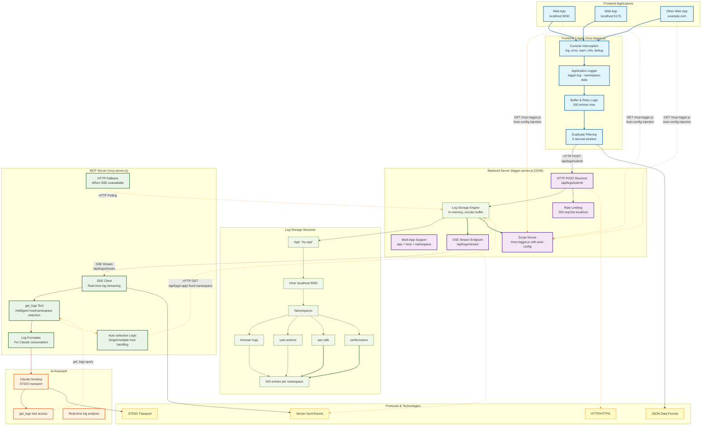

# Browser Logger System Architecture

## Key Features

- **Multi-Application Support**: Separate log storage for each app
- **Multi-Host Support**: Different frontend hosts tracked separately
- **Namespace Organization**: Browser, user-actions, api-calls, performance logs
- **Real-time Streaming**: SSE-based log delivery to AI assistants
- **Fallback Mechanisms**: HTTP polling when SSE unavailable
- **Auto-Configuration**: Backend injects config when serving logger script
- **Buffer & Retry**: Frontend handles backend unavailability gracefully
- **Duplicate Filtering**: Prevents log spam at multiple levels
- **Rate Limiting**: Protects backend from abuse